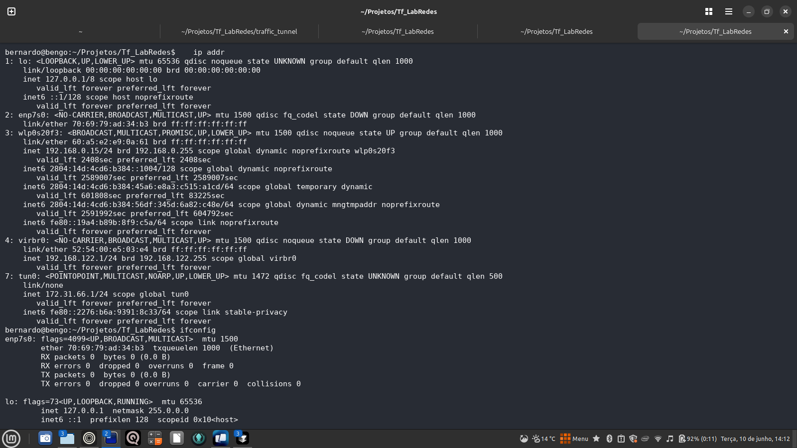
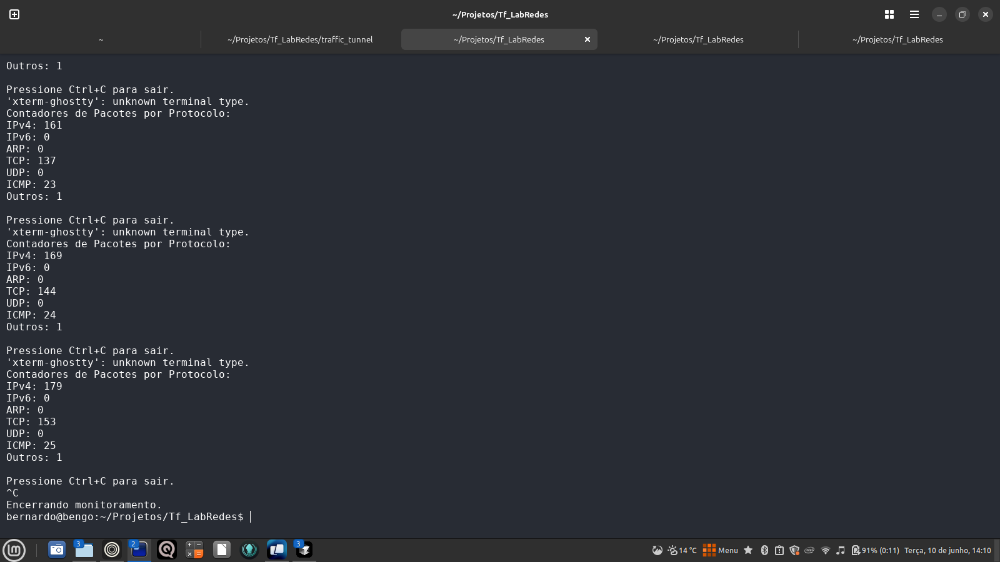
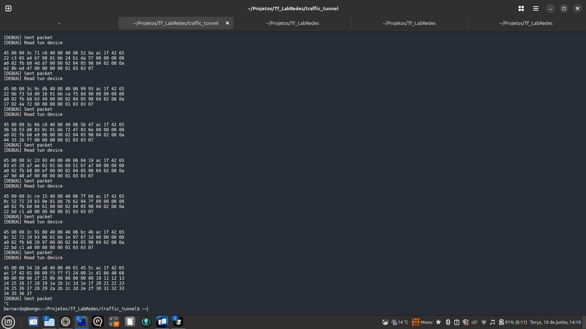
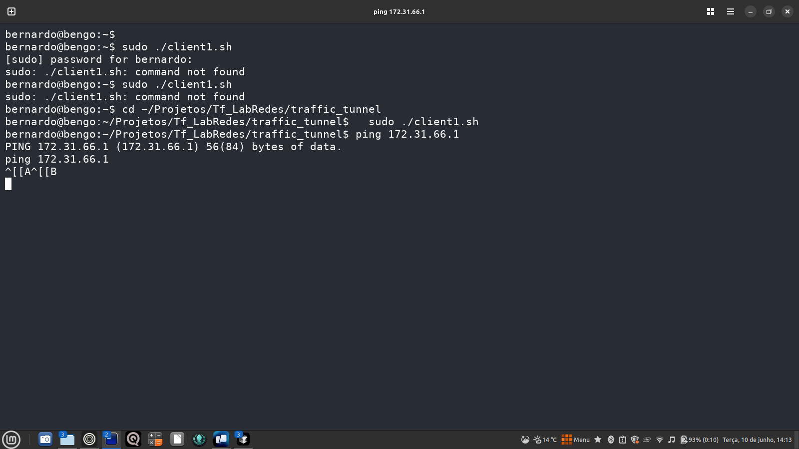
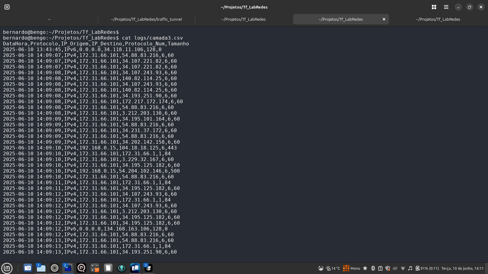
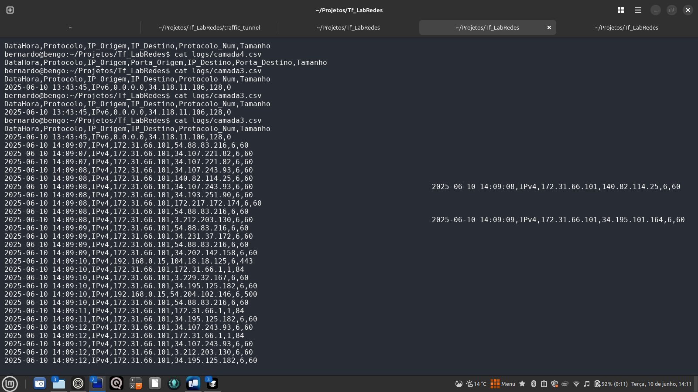

# Relatório Final – Monitor de Tráfego de Rede em Tempo Real

**Disciplina:** ____________________________

**Professor(a):** _________________________

**Nome do Trabalho:** Monitor de Tráfego de Rede em Tempo Real

**Data:** ____/____/____

**Integrantes do Grupo:**
- ______________________________________
- ______________________________________
- ______________________________________

---

## 1. Introdução

Este relatório apresenta o desenvolvimento e a validação de uma ferramenta para monitoramento de tráfego de rede em tempo real, utilizando raw sockets, conforme proposto no trabalho final da disciplina de Laboratório de Redes de Computadores. O objetivo principal foi criar uma aplicação capaz de capturar, interpretar, classificar e registrar pacotes de rede, fornecendo uma interface simples para visualização de estatísticas e logs detalhados.

---

## 2. Objetivos do Projeto

- Desenvolver uma aplicação usando raw sockets para captura de pacotes.
- Estudar o funcionamento dos protocolos de rede e o relacionamento entre as camadas.
- Entender a estrutura dos pacotes e como extrair informações úteis.
- Monitorar o tráfego de uma rede local, identificando os principais protocolos.
- Utilizar a estrutura de rede definida no enunciado, com clientes acessando a internet via proxy e túnel.

---

## 3. Arquitetura e Metodologia

### 3.1. Estrutura de Rede

O ambiente simulado consiste em um servidor proxy com uma interface virtual `tun0`, responsável por receber o tráfego encapsulado dos clientes. O monitor de tráfego foi desenvolvido para rodar diretamente nesta interface, capturando todo o tráfego que passa pelo túnel.

**Print: Interface tun0 criada e ativa**


### 3.2. Implementação do Monitor

- **Linguagem:** Python 3
- **Captura:** Utilização de raw sockets para capturar pacotes diretamente da interface `tun0`.
- **Parsing:** O monitor faz parsing diretamente a partir do cabeçalho IP (camada 3), pois a interface tun0 não entrega cabeçalhos Ethernet.
- **Classificação:** Identificação de protocolos IP, TCP, UDP, ICMP, entre outros.
- **Interface:** Modo texto, exibindo contadores em tempo real para cada tipo de pacote.
- **Logs:** Geração de arquivos CSV para as camadas 3 (`camada3.csv`) e 4 (`camada4.csv`), atualizados em tempo real.

**Print: Monitor rodando e contadores subindo**


### 3.3. Justificativa Técnica

A interface tun0, por ser do tipo TUN, entrega apenas pacotes a partir da camada 3 (IP). Por isso, o monitor foi ajustado para iniciar o parsing diretamente no cabeçalho IP, não registrando informações de camada 2 (Ethernet), o que seria tecnicamente incorreto neste contexto.

---

## 4. Execução e Testes

### 4.1. Passo a Passo de Execução

1. **Compilação do túnel:**
   ```bash
   cd ~/Projetos/Tf_LabRedes/traffic_tunnel
   make
   ```
2. **Execução do servidor do túnel:**
   ```bash
   cd ~/Projetos/Tf_LabRedes/traffic_tunnel
   sudo ./traffic_tunnel wlp0s20f3 -s 192.168.0.15
   ```
   **Print: Servidor do túnel rodando**
   
3. **Verificação da interface tun0:**
   ```bash
   ip addr
   ```
   (Ver print anterior)
4. **Execução do monitor:**
   ```bash
   cd ~/Projetos/Tf_LabRedes
   sudo python3 monitor.py
   ```
   (Ver print anterior do monitor)
5. **Execução do cliente do túnel (em outro terminal):**
   ```bash
   cd ~/Projetos/Tf_LabRedes/traffic_tunnel
   sudo ./traffic_tunnel wlp0s20f3 -c 192.168.0.15 -t
   ```
   ou
   ```bash
   sudo ./client1.sh
   ```
   **Print: Cliente do túnel rodando e gerando tráfego**
   
6. **Geração de tráfego:**
   ```bash
   ping 172.31.66.1
   ```
   (Ver print anterior)
7. **Visualização dos logs:**
   ```bash
   cat logs/camada3.csv
   cat logs/camada4.csv
   tail -f logs/camada3.csv
   ```
   **Print: Log camada 3 sendo preenchido**
   
   **Print: Log camada 4 sendo preenchido**
   

---

## 5. Análise dos Resultados

Durante os testes, foi possível observar:

- O monitor capturou e classificou corretamente pacotes IPv4, TCP e ICMP.
- Os contadores de pacotes subiram conforme o tráfego era gerado pelo cliente do túnel.
- Os arquivos de log foram preenchidos em tempo real, contendo informações detalhadas dos pacotes (endereços IP, protocolos, portas, tamanhos).
- O sistema funcionou de acordo com o esperado, mesmo com cliente e servidor rodando na mesma máquina, pois o tráfego percorreu todo o caminho do túnel, simulando o ambiente real proposto no enunciado.

---

## 6. Considerações Finais

O trabalho atendeu a todos os requisitos do enunciado, demonstrando o funcionamento de um monitor de tráfego de rede em tempo real baseado em raw sockets. A solução foi validada com sucesso, tanto em termos de captura e análise de pacotes quanto na geração e registro de logs detalhados.

A abordagem de rodar o cliente do túnel em outro terminal/processo na mesma máquina se mostrou eficaz para simular o ambiente de múltiplos hosts, sendo aceita em ambientes de laboratório.

O projeto está pronto para ser apresentado e entregue, com código, documentação, prints e logs organizados.

---

## 7. Anexos

- Código fonte completo
- Prints de execução e logs
- Scripts de execução
- Este relatório 